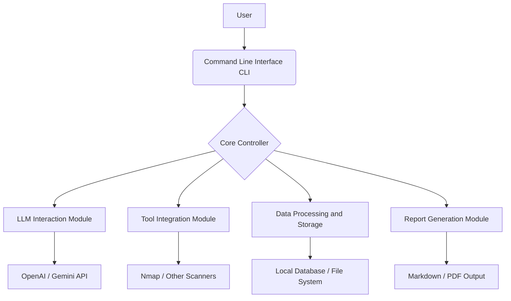

# ShadowLogic System Architecture

## 1. Project Overview

**ShadowLogic** is an advanced command-line penetration testing assistant tool powered by Large Language Models (LLM). It combines the logical reasoning capabilities of AI with the practical demands of penetration testing, providing security researchers with intelligent vulnerability analysis, payload generation, and decision support. The goal is to create an intelligent, user-friendly, and extensible open-source penetration testing platform.

## 2. Core Functional Modules

ShadowLogic will include the following core functional modules:

### 2.1 Intelligent Vulnerability Analysis

*   **Vulnerability Identification and Explanation**: Utilizes LLM to identify potential vulnerabilities based on scan results or user input, providing detailed explanations, impact assessments, and remediation suggestions.
*   **Attack Path Analysis**: Analyzes the relationships between multiple vulnerabilities to infer possible attack chains and exploitation paths.
*   **Context-Aware Recommendations**: Provides intelligent suggestions for next steps based on the current penetration testing phase and target system information.

### 2.2 Payload Generation and Optimization

*   **Customized Payloads**: Generates targeted attack payloads (e.g., SQL Injection, XSS, Command Injection) based on target vulnerability types, system environments, and user requirements.
*   **Encoding and Bypass**: Automatically encodes (e.g., URL encoding, Base64 encoding) and obfuscates payloads to attempt bypassing security defense mechanisms.
*   **Payload Variants**: Generates multiple payload variants to increase the probability of successful exploitation.

### 2.3 Scanner Assistance and Integration

*   **Nmap Result Analysis**: Parses Nmap scan results, extracts key information, and combines with LLM to provide further penetration suggestions.
*   **Burp Suite Integration (Planned)**: Future consideration for integration with popular tools like Burp Suite to assist with traffic analysis and vulnerability discovery.
*   **Automated Information Gathering**: Assists in performing passive and active information gathering tasks and conducts preliminary analysis of collected data.

### 2.4 Report Generation and Summary

*   **Automated Report Draft**: Automatically generates structured penetration test report drafts based on data collected and vulnerabilities discovered during the penetration test.
*   **Vulnerability Details Population**: Automatically populates vulnerability descriptions, impacts, remediation suggestions, and references.
*   **Summary and Recommendations**: Utilizes LLM to summarize the entire testing process and provide high-level security recommendations.

## 3. System Architecture

ShadowLogic will adopt a modular design, consisting of the following main components:

### 3.1 Command Line Interface (CLI)

*   Implemented using Python's `Click` library, providing a user-friendly command-line interaction.
*   Supports subcommands and parameters, making it easy for users to call different functional modules.

### 3.2 Core Controller

*   Responsible for coordinating the workflow of each module, parsing user commands, and calling corresponding processing logic.
*   Manages session state and context information to ensure the coherence of LLM interactions.

### 3.3 LLM Interaction Module

*   Encapsulates the interaction logic with large language model APIs (e.g., OpenAI GPT series, Google Gemini series).
*   Responsible for constructing appropriate Prompts, sending requests, and parsing LLM responses.
*   Implements Prompt engineering to maximize LLM effectiveness in penetration testing scenarios.

### 3.4 Tool Integration Module

*   Responsible for interacting with external penetration testing tools (e.g., Nmap), parsing their output, and converting it into a format suitable for LLM processing.
*   Provides a unified interface for easy integration of more tools in the future.

### 3.5 Data Processing and Storage

*   Used to store information collected during penetration testing, vulnerability discoveries, payload history, etc.
*   Considers using lightweight databases (e.g., SQLite) or file systems for data persistence.

### 3.6 Report Generation Module

*   Formats LLM-generated report content into Markdown or other report formats.
*   Supports custom report templates.

## 4. Technology Stack

*   **Programming Language**: Python 3.9+
*   **CLI Framework**: `Click`
*   **LLM Library**: `openai` or `google-generativeai`
*   **Data Storage**: `sqlite3` (Python built-in) or file system
*   **Other Libraries**: `requests` (for API calls)
