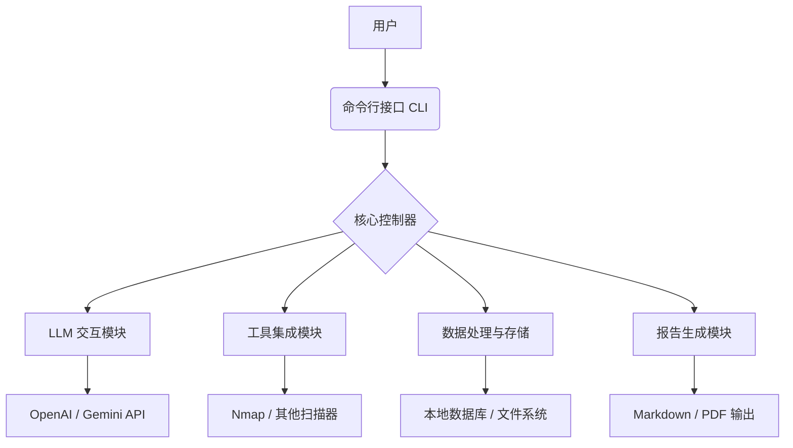

# ShadowLogic 系统架构

## 1. 项目概述

**ShadowLogic** 是一款基于大型语言模型（LLM）的先进命令行渗透测试辅助工具。它将 AI 的逻辑推理能力与渗透测试的实战需求相结合，为安全研究人员提供智能化的漏洞分析、Payload 生成和决策支持。目标是创建一个智能、易用且可扩展的开源渗透测试平台。

## 2. 核心功能模块

ShadowLogic 包含以下核心功能模块：

### 2.1 智能漏洞分析

*   **漏洞识别与解释**：根据扫描结果或用户输入，利用 LLM 识别潜在漏洞，并提供详细的漏洞解释、影响评估和修复建议。
*   **攻击路径分析**：分析多个漏洞之间的关联，推断可能的攻击链和利用路径。
*   **上下文感知建议**：根据当前渗透测试阶段和目标系统信息，提供下一步操作的智能建议。

### 2.2 Payload 生成与优化

*   **定制化 Payload**：根据目标漏洞类型、系统环境和用户需求，生成针对性的攻击 Payload（如 SQL 注入、XSS、命令注入等）。
*   **编码与绕过**：自动对 Payload 进行编码（如 URL 编码、Base64 编码）和混淆，尝试绕过安全防护机制。
*   **Payload 变种**：生成多种 Payload 变种，以增加成功利用的概率。

### 2.3 扫描辅助与集成

*   **Nmap 结果分析**：解析 Nmap 扫描结果，提取关键信息，并结合 LLM 提供进一步的渗透建议。
*   **Burp Suite 集成（规划中）**：未来考虑与 Burp Suite 等流行工具集成，辅助流量分析和漏洞发现。
*   **自动化信息收集**：辅助执行被动和主动信息收集任务，并对收集到的数据进行初步分析。

### 2.4 报告生成与总结

*   **自动化报告草稿**：根据渗透测试过程中收集的数据和发现的漏洞，自动生成结构化的渗透测试报告草稿。
*   **漏洞详情填充**：自动填充漏洞描述、影响、修复建议和参考资料。
*   **总结与建议**：利用 LLM 对整个测试过程进行总结，并提供高层级的安全建议。

## 3. 系统架构

ShadowLogic 采用模块化设计，主要由以下组件构成：

### 3.1 命令行接口 (CLI)

*   基于 Python 的 `Click` 库实现，提供友好的命令行交互。
*   支持子命令和参数，方便用户调用不同功能模块。

### 3.2 核心控制器

*   负责协调各个模块的工作流程，解析用户命令，调用相应的处理逻辑。
*   管理会话状态和上下文信息，确保 LLM 交互的连贯性。

### 3.3 LLM 交互模块

*   封装与大型语言模型 API（如 OpenAI GPT 系列、Google Gemini 系列）的交互逻辑。
*   负责构建合适的 Prompt，发送请求，并解析 LLM 返回的结果。
*   实现 Prompt 工程，以最大化 LLM 在渗透测试场景中的效能。

### 3.4 工具集成模块

*   负责与外部渗透测试工具（如 Nmap）进行交互，解析其输出，并将其转换为可供 LLM 处理的格式。
*   提供统一的接口，方便未来集成更多工具。

### 3.5 数据处理与存储

*   用于存储渗透测试过程中收集的信息、漏洞发现、Payload 历史等。
*   考虑使用轻量级数据库（如 SQLite）或文件系统进行数据持久化。

### 3.6 报告生成模块

*   将 LLM 生成的报告内容格式化为 Markdown 或其他报告格式。
*   支持自定义报告模板。

## 4. 技术栈

*   **编程语言**：Python 3.9+
*   **CLI 框架**：`Click`
*   **LLM 库**：`openai` 或 `google-generativeai`
*   **数据存储**：`sqlite3` (Python 内置) 或文件系统
*   **其他库**：`requests` (用于 API 调用)
