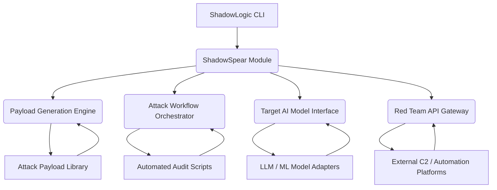
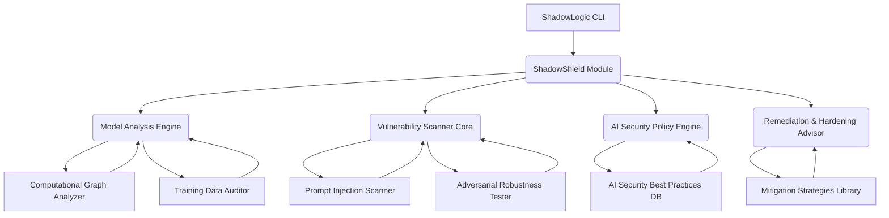

# ShadowLogic Ecosystem Architecture: ShadowSpear & ShadowShield

## 1. Introduction

To transform **ShadowLogic** into a comprehensive AI security ecosystem, we are introducing two pivotal components: **ShadowSpear** (The Attacker's Toolkit) and **ShadowShield** (The Defender's Scanner). This document outlines the architectural design for these new tools and their integration within the broader ShadowLogic framework, aiming to establish a powerful, dual-purpose platform for both offensive and defensive AI security operations.

## 2. ShadowSpear: The Attacker's Toolkit

**ShadowSpear** will extend ShadowLogic's offensive capabilities, providing security researchers and red teams with advanced, modular tools for AI model auditing, vulnerability exploitation, and APT simulation. It will focus on making complex attack techniques against AI systems more accessible and efficient.

### 2.1 Core Objectives

*   **Modular Attack Payload Library**: Develop a flexible and extensible library for generating and managing diverse attack payloads targeting various AI models and systems.
*   **Automated Auditing Workflows**: Provide streamlined workflows for conducting security audits against AI models, including prompt injection, data poisoning, model inversion, and adversarial attacks.
*   **Red Team API Integration**: Offer standardized APIs to allow seamless integration of ShadowSpear's offensive capabilities into existing Red Team Command and Control (C2) frameworks and automated penetration testing platforms.
*   **AI-Specific Exploitation**: Focus on vulnerabilities unique to AI/ML systems, such as those related to model architecture, training data, and inference processes.

### 2.2 Architectural Components

#### 2.2.1 Payload Generation Engine

*   **Function**: Responsible for creating and customizing attack payloads based on specified vulnerability types, target AI model characteristics, and desired attack objectives.
*   **Key Features**: Supports various payload types (e.g., prompt injection strings, adversarial examples, data poisoning samples), encoding/obfuscation techniques, and context-aware generation.
*   **Integration**: Leverages ShadowLogic's existing LLM Agent Core for intelligent payload crafting and refinement.

#### 2.2.2 Attack Workflow Orchestrator

*   **Function**: Manages the execution of multi-step attack scenarios and automated auditing processes against AI models.
*   **Key Features**: Defines attack playbooks, handles state management during attacks, and coordinates the use of different attack modules.
*   **Integration**: Interacts with the Target AI Model Interface to deliver payloads and collect responses.

#### 2.2.3 Target AI Model Interface

*   **Function**: Provides a standardized way for ShadowSpear to interact with various types of AI models (e.g., LLMs, image recognition models, recommendation systems).
*   **Key Features**: Abstracted interfaces for sending inputs, receiving outputs, and potentially querying model metadata. Supports different communication protocols (e.g., REST API, gRPC, direct library calls).

#### 2.2.4 Red Team API Gateway

*   **Function**: Exposes ShadowSpear's capabilities via a programmatic interface, allowing external Red Team tools and automation platforms to invoke specific attack functions.
*   **Key Features**: RESTful API design, authentication/authorization mechanisms, and clear documentation for integration.

## 3. ShadowShield: The Defender's Scanner

**ShadowShield** will serve as the defensive counterpart, providing tools and methodologies to detect and mitigate vulnerabilities within AI models and systems. It aims to empower developers and security teams to proactively identify and address AI-specific security risks.

### 3.1 Core Objectives

*   **AI Model Backdoor Detection**: Develop specialized scanning capabilities to identify computational graph backdoors, data poisoning, and other forms of malicious model tampering.
*   **Prompt Injection Vulnerability Scanning**: Automatically scan AI applications for susceptibility to prompt injection attacks and provide actionable remediation advice.
*   **Adversarial Robustness Assessment**: Evaluate the robustness of AI models against adversarial examples and suggest hardening techniques.
*   **Security Configuration Auditing**: Audit the security configurations of AI deployment environments and associated infrastructure.

### 3.2 Architectural Components

#### 3.2.1 Model Analysis Engine

*   **Function**: Performs deep static and dynamic analysis of AI models to uncover hidden vulnerabilities and malicious modifications.
*   **Key Features**: Includes a **Computational Graph Analyzer** to detect backdoors or unusual logic flows, and a **Training Data Auditor** to identify data poisoning or bias.

#### 3.2.2 Vulnerability Scanner Core

*   **Function**: Executes various scanning techniques specifically designed for AI systems.
*   **Key Features**: A **Prompt Injection Scanner** to test LLM applications, and an **Adversarial Robustness Tester** to assess model resilience against adversarial attacks.

#### 3.2.3 AI Security Policy Engine

*   **Function**: Evaluates AI models and deployments against established security policies and best practices.
*   **Key Features**: Integrates an **AI Security Best Practices Database** (e.g., OWASP Top 10 for LLMs, MITRE ATLAS) to provide compliance checks and recommendations.

#### 3.2.4 Remediation & Hardening Advisor

*   **Function**: Provides actionable advice and automated scripts for mitigating identified vulnerabilities and hardening AI systems.
*   **Key Features**: Offers specific code examples, configuration changes, and architectural recommendations to improve AI model security.

## 4. Integration with ShadowLogic Core

Both ShadowSpear and ShadowShield will be tightly integrated with the existing ShadowLogic Core, leveraging its LLM Agent Core, Tool & Skill Manager, and Data Processing capabilities. The Core Orchestrator will manage the execution flow, allowing seamless transitions between offensive and defensive operations.

## 5. Ecosystem Development & Community

To foster a vibrant ecosystem, ShadowLogic will adopt a plugin-based architecture, enabling community contributions for new attack modules, detection techniques, and model adapters. A dedicated community platform (e.g., ShadowHub) will facilitate knowledge sharing, threat intelligence exchange, and collaborative development.

This expanded architecture positions ShadowLogic as a leading platform for AI security, offering a holistic approach to understanding, testing, and defending against threats to intelligent systems.
