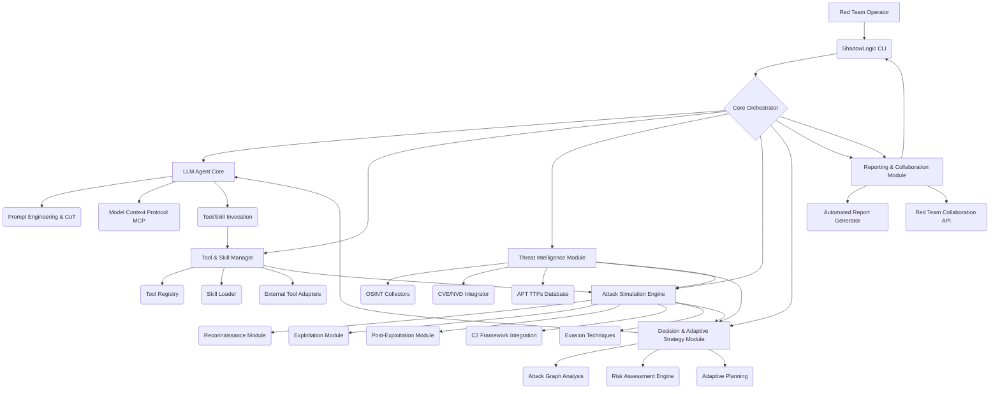

# ShadowLogic Advanced Architecture for Red Teaming & APT Simulation

## 1. Introduction

To elevate **ShadowLogic** to the level of powerful and influential tools like OpenClaw in the penetration testing and Red Team APT (Advanced Persistent Threat) simulation domain, a significant architectural expansion and enhancement are required. This document outlines the proposed advanced architecture, integrating concepts from OpenClaw and addressing the specific needs of sophisticated offensive security operations.

## 2. Core Principles for Advanced ShadowLogic

Drawing inspiration from OpenClaw and the demands of Red Teaming, ShadowLogic will be built upon the following core principles:

*   **Agentic Loop (ReAct Pattern)**: Implement a robust Reason-Act loop to enable intelligent decision-making, tool execution, and iterative problem-solving, moving beyond simple request-response. This will allow ShadowLogic to dynamically adapt to target environments and execute complex attack sequences.
*   **Modular Tooling & Skill System**: Develop a flexible framework for integrating diverse security tools (scanners, exploit frameworks, C2 channels) as 
a "skill" system, allowing ShadowLogic to dynamically load and utilize capabilities based on the task at hand.
*   **Context-Awareness & Persistent Memory**: Implement a sophisticated memory system to maintain context across multiple interactions and attack phases, enabling ShadowLogic to learn from past actions and adapt its strategies.
*   **Threat Intelligence Integration**: Incorporate external threat intelligence sources to enrich analysis, identify emerging threats, and inform attack simulations.
*   **Ethical & Controlled Execution**: Ensure all advanced functionalities are designed with strong ethical guidelines and control mechanisms, emphasizing authorized use and preventing misuse.

## 3. Expanded System Architecture

To support the new capabilities, the ShadowLogic architecture will be expanded as follows:

### 3.1 Core Orchestrator

*   **Role**: The central brain of ShadowLogic, responsible for managing the overall workflow, coordinating between different modules, and maintaining the agentic loop.
*   **Key Functions**: Session management, task scheduling, context propagation, and error handling.

### 3.2 LLM Agent Core

*   **Prompt Engineering & CoT**: Advanced prompt design to guide the LLM through complex reasoning processes (Chain-of-Thought) for vulnerability analysis, attack planning, and decision-making, specifically tailored for red teaming scenarios.
*   **Model Context Protocol (MCP)**: A standardized interface for the LLM to interact with external tools and services, inspired by OpenClaw. This allows for dynamic tool discovery and invocation.
*   **Tool/Skill Invocation**: The mechanism by which the LLM requests the execution of specific tools or skills, passing necessary parameters.

### 3.3 Tool & Skill Manager

*   **Tool Registry**: A catalog of all available internal and external tools, along with their schemas and capabilities.
*   **Skill Loader**: Dynamically loads 
and executes skills (which are essentially specialized toolsets or workflows) based on LLM requests.
*   **External Tool Adapters**: Provides interfaces to integrate with various external red teaming tools (e.g., Nmap, Metasploit, Cobalt Strike, BloodHound, Empire) and C2 frameworks.

### 3.4 Threat Intelligence Module

*   **OSINT Collectors**: Gathers open-source intelligence (OSINT) from various public sources to enrich target profiles.
*   **CVE/NVD Integrator**: Integrates with common vulnerability databases (CVE, NVD) to retrieve detailed vulnerability information and exploit availability.
*   **APT TTPs Database**: Maintains a database of known APT Tactics, Techniques, and Procedures (TTPs) (e.g., MITRE ATT&CK framework) to inform attack simulations and provide context for analysis.

### 3.5 Attack Simulation Engine

*   **Reconnaissance Module**: Automates passive and active reconnaissance, including domain enumeration, sub-domain discovery, port scanning, service fingerprinting, and web technology identification.
*   **Exploitation Module**: Integrates with exploit frameworks to identify and execute exploits for discovered vulnerabilities.
*   **Post-Exploitation Module**: Handles post-exploitation activities such as privilege escalation, lateral movement, and data exfiltration.
*   **C2 Framework Integration**: Provides seamless integration with Command and Control (C2) frameworks for persistent access and remote control.
*   **Evasion Techniques**: Incorporates techniques to bypass security controls like EDR, AV, WAF, and network intrusion detection systems.

### 3.6 Decision & Adaptive Strategy Module

*   **Attack Graph Analysis**: Constructs and analyzes attack graphs to identify optimal attack paths and critical assets.
*   **Risk Assessment Engine**: Dynamically assesses the risk of identified vulnerabilities and potential attack paths, guiding the LLM's decision-making.
*   **Adaptive Planning**: Based on real-time feedback and environmental changes, the module helps the LLM adapt its attack strategy and tactics.

### 3.7 Reporting & Collaboration Module

*   **Automated Report Generator**: Generates comprehensive red team reports, including executive summaries, detailed attack narratives, evidence of compromise, TTPs used, and actionable recommendations.
*   **Red Team Collaboration API**: Provides interfaces for red team members to share information, coordinate actions, and track progress within the ShadowLogic platform.

## 4. Technology Stack Considerations

*   **Core Language**: Python 3.9+
*   **LLM Integration**: OpenAI API, Google Gemini API, potentially local LLMs via Ollama.
*   **CLI Framework**: `Click` for robust command-line interaction.
*   **Tool Integration**: `subprocess` for external tool execution, custom Python wrappers for specific tools.
*   **Data Storage**: PostgreSQL or MongoDB for complex structured and unstructured data, SQLite for lightweight local storage.
*   **Messaging/Communication**: Potentially integrate with messaging queues (e.g., RabbitMQ, Kafka) for inter-module communication in a distributed setup.
*   **UI (Future)**: Web-based UI using frameworks like React/Vue.js with FastAPI/Flask backend for enhanced visualization and interaction.

## 5. Development Roadmap (High-Level)

1.  **Phase 1: Core Agentic Loop & Basic Tooling**: Establish the ReAct loop, integrate initial tools (Nmap, ZAP), and refine LLM interaction.
2.  **Phase 2: Advanced Threat Simulation**: Develop modules for reconnaissance, exploitation, and post-exploitation, focusing on APT TTPs.
3.  **Phase 3: Intelligent Decision & Adaptive Strategy**: Implement attack graph analysis, risk assessment, and adaptive planning capabilities.
4.  **Phase 4: Threat Intelligence & Collaboration**: Integrate external TI sources and develop collaboration features.
5.  **Phase 5: UI & Deployment**: Build a user interface and streamline deployment processes.

This advanced architecture will serve as the blueprint for transforming ShadowLogic into a leading AI-powered platform for red teaming and APT simulation, offering unparalleled intelligence and automation to offensive security professionals.
